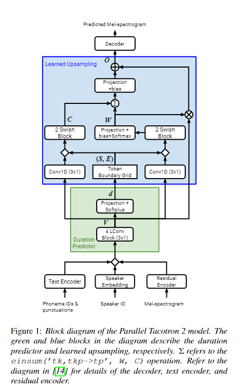

# Parallel_Tacotron2

<p align="center">
 
</p>

Unofficial Pytorch implementation of [Parallel Tacotron2](https://arxiv.org/abs/2103.14574) with [pytorch lightning.](https://www.pytorchlightning.ai/)

# Installation
## Requirements

- Linux
- Python 3.7+
- PyTorch 1.11.0 or higher and CUDA

a. Create a conda virtual environment and activate it.

```shell
conda create -n TTS python=3.7
conda activate TTS
```

b. Install PyTorch and torchvision following the [official instructions](https://pytorch.org/)

c. Clone this repository.

```shell
git clone https://github.com/yw0nam/Parallel_Tacotron2
cd Parallel_Tacotron2
```

d. Install requirments.

```shell
pip install -r requirements.txt
```

# Prepare for training

Currently, this repository support Only LJSppeech dataset 

a. Prepare data 

- csv_path: LJspeech csv_path  ex) ./LJSpeech-1.1/metadata.csv 

```shell
python preprocess.py --csv_path your_ljspeech_csv_path
```

b. Set config

check config.py and change config argument in train.py for your environment.

# Train 

Run Training code

This repository support multi gpu training.

If you have single gpu,

```shell
CUDA_VISIBLE_DEVICES=0 python train.py
```

if you have more than 2

```shell
CUDA_VISIBLE_DEVICES=0,1 python train.py
```

# Result,

it will be published soon,

# Issue

Half precision with Deepspeed cause nan value in SoftDTW.


# Special Thanks

Many parts of my codes were come from [keonlee9420](https://github.com/keonlee9420)
